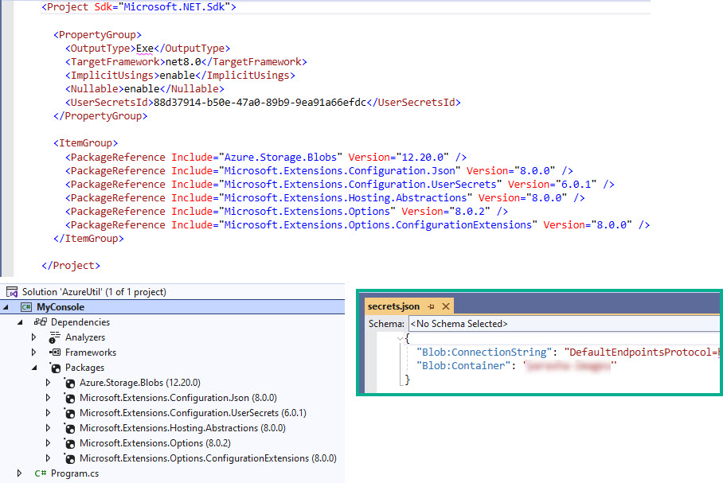

# AzureUtil

## MyConsole
- [ ] ToDo: Rename this console app to SqlServerCodeGen

### `MyConsole.csproj` is a...
- .Net 8 console app 
- uses `secrets.json` to hold azure credentials
- uses the older style of `private static void Main(string[] args)`
- `Azure.Storage.Blobs`` to interact with the Azure
- uses `Microsoft.Extensions.Configuration` and `ConfigurationBuilder` to pull in `secrets.json` which enables the json elements to be extracted

### `ConfigurationBuilder`
```csharp
	var config = new ConfigurationBuilder()
		.AddUserSecrets<Program>()
		.Build();
```

### Extract secret configuration and setup Azure vars
```csharp
	string blobConnectionString = $"{config["Blob:ConnectionString"]}";
	string blobContainer = $"{config["Blob:Container"]}";

	BlobServiceClient blobServiceClient = new BlobServiceClient(blobConnectionString);
	BlobContainerClient containerClient = blobServiceClient.GetBlobContainerClient(blobContainer);
```

### Function
The purpose of the console app is to loop through a container and output to the console Sql Server UPDATE statements

```csharp
	List<string> blobNamesList = containerClient.GetBlobs().Select(b => b.Name).ToList();

	foreach (string item in blobNamesList)
	{
		Console.WriteLine($"UPDATE WeeklyVideo SET GraphicFile='{item}' WHERE WeeklyVideoTypeId=1 AND ShabbatWeekId={item.Substring(0, 3).TrimStart('0')}");
	}
```

### `secrets.json` and Nuget Packages



# Other
- [Console Templates](https://aka.ms/new-console-template for more information)
